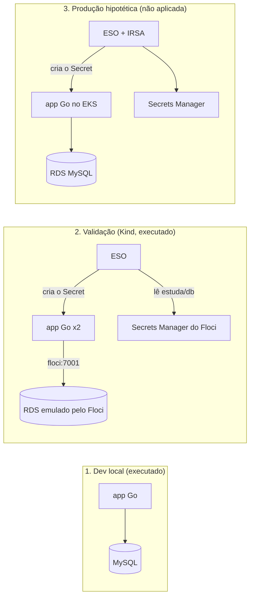

# Estuda.com DevOps case

API REST de usuários (Go + MySQL) com execução em containers, Kubernetes (Helm), observabilidade e infraestrutura como código.
Decisões e alternativas: [DECISIONS.md](DECISIONS.md). Uso de IA: [AI_USAGE.md](AI_USAGE.md).

> **Estado.** Cada seção indica se o procedimento foi **validado** (executado com sucesso). Tudo o que está marcado como
> validado foi executado na VM descrita na seção 2 e/ou no GitHub Actions. A produção (EKS) é **hipotética**: o código
> é validado e escaneado, mas nunca aplicado.
>
> **Roteiro de leitura:** seções 3 a 9 (operar), 10 (Terraform), 10.1 (CI/CD), 11 (respostas do enunciado). Decisões em
> [DECISIONS.md](DECISIONS.md), runbook em [docs/runbook.md](docs/runbook.md), incidente em
> [docs/incidente.md](docs/incidente.md), custos em [docs/custos.md](docs/custos.md) e mentoria em
> [docs/mentoria.md](docs/mentoria.md).

## 1. Visão geral: três contextos



| Contexto | O que roda | Executado? |
|---|---|---|
| Dev local | `docker compose`: app + MySQL + migrations | Sim, **validado** |
| Validação | **Kind** + Helm + Ingress NGINX + ESO + kube-prometheus-stack, com **Floci** (VPC, RDS e Secrets Manager provisionados pelo Terraform): deploy, smoke, rollback, observabilidade e CD no GitHub | Sim, **validado** |
| Produção | Terraform: EKS, RDS, Secrets Manager, IRSA, ECR | **Não**: só código validado e escaneado (`make tf-check`) |

### Kind em vez de EKS
Neste projeto o Kubernetes é o **Kind**, usado **apenas para validar** o chart Helm e a operação (deploy, probes,
rollback, métricas). Em **produção o alvo é o EKS**, com ALB Controller no lugar do Ingress NGINX e IRSA no lugar
de credenciais estáticas. O mesmo chart (`helm/app`) serve aos dois; só mudam os values (`values-local.yaml` /
`values-aws.yaml`). O Floci chegou a ser avaliado como EKS emulado e foi descartado (ver DECISIONS.md).

> O Terraform de produção **nunca é aplicado** contra a AWS real. "Provisionar" neste projeto significa
> `make tf-check` (fmt, validate, tflint, Checkov).

## 2. Pré-requisitos

### Ambiente em que tudo foi construído e validado

Todo o processo (compose, Kind, Helm, Floci, ESO, Prometheus/Grafana e Terraform local) foi executado em uma **VM
Debian 13 com 4 vCPUs e 4 GB de RAM**. Funciona nesse tamanho, mas com folga pequena: os primeiros boots são lentos
(imagens grandes, RDS emulado, Grafana) e por isso os timeouts do Makefile são generosos
(ver a tabela de problemas na seção 7). Com mais recursos tudo sobe mais rápido; com menos de 4 GB, não rode o
docker compose e o Kind ao mesmo tempo.

Para instalar tudo (Docker, Go, kind, kubectl, helm, Terraform, tflint,
golangci-lint, Checkov, AWS CLI):

```bash
./scripts/bootstrap.sh   # como usuário normal, com sudo; depois saia e entre de novo no SSH (grupo docker)
```

As versões instaladas são as mais recentes na data da execução; fixe-as no topo do script para reprodutibilidade.

## 3. Executar localmente (docker compose): **validado**

```bash
docker compose up --build -d   # ou `make up`: app + MySQL + migrations, sem nenhum arquivo extra
                               # (padrões de desenvolvimento no compose; `.env` é opcional: cp .env.example .env)
curl -s -X POST localhost:8080/users -H 'Content-Type: application/json' \
  -d '{"name":"João Silva","email":"joao@example.com","password":"senha-segura"}'
curl -s localhost:8080/users
make down                # remove containers e o volume
```

Testes: `make test` (usa `-race`, que exige `gcc`; o `bootstrap.sh` instala `build-essential`).

## 4. Deploy no Kind: **validado** (deploy, smoke, rollback e recriação de pods)

No Kubernetes há **um único fluxo**, o que espelha a produção: o banco é um **RDS** (emulado pelo Floci no Kind) e o
segredo vem do **Secrets Manager** via ESO. Não há MySQL dentro do cluster; o MySQL do docker compose (seção 3) é só
para desenvolvimento local. O RDS emulado pode demorar a aceitar conexões depois de `available`, por isso o hook de
migration tem `backoffLimit: 5`.

```bash
make down          # libera RAM: não rode compose e Kind juntos
make kind-up       # sobe o Floci, cria o cluster Kind, conecta o Floci à rede do Kind, instala ingress-nginx e ESO
                   # (obrigatório antes do deploy; o 1º pull das imagens é lento, os timeouts são de 10 min)
make tf-apply-local # cria no Floci a VPC, o RDS e os segredos estuda/db e estuda/grafana, com os mesmos módulos de
                   # produção (seção 10)
make monitoring-up # kube-prometheus-stack (Prometheus + Grafana). A senha do Grafana vem do Secrets Manager via ESO,
                   # por isso vem DEPOIS do tf-apply-local. Pesa na RAM: pule-o com `make deploy MONITORING=false`
                   # (o CD faz isso); sem ele o chart não instala ServiceMonitor, alertas nem dashboard
make deploy        # build das imagens, kind load, release platform (SecretStore/ExternalSecret) e release app
                   # (hook de migration, depois Deployment). DB_HOST = floci:7001 (proxy do RDS emulado)
make smoke         # 201, 409, lista sem senha, /healthz, /readyz, /metrics, e /metrics fora do Ingress
```

Para testar à mão pelo Ingress (a rota só atende o `Host: estuda.local`):

```bash
curl -s -H 'Host: estuda.local' -H 'Content-Type: application/json' localhost/users \
  -d '{"name":"João Silva","email":"joao@example.com","password":"senha-segura"}'
curl -s -H 'Host: estuda.local' localhost/users
```

Os alvos do Makefile **sempre usam o contexto `kind-estuda`**: nunca atuam em outro cluster do seu kubeconfig.
Os alvos `floci-creds`, `smoke` e `rollback` verificam antes se o cluster existe.

Por que dois releases Helm (`platform` e `app`): o hook de migration (`pre-install`/`pre-upgrade`) roda antes dos
demais recursos do release. O `SecretStore`/`ExternalSecret` ficam no `platform` para que o Secret `estuda-db` já
exista quando o Job de migration rodar.

**Como o segredo chega à aplicação (validado):** o ESO lê `estuda/db` do Secrets Manager (Floci) e cria o Secret
`estuda-db` apenas com `DB_NAME`, `DB_USER` e `DB_PASSWORD` (a senha root nunca entra no cluster). O Deployment e o
Job de migration consomem essas chaves por `secretKeyRef`. Em produção só muda a autenticação (IRSA, sem credenciais
estáticas) e o `DB_HOST` (endpoint do RDS).

**Comportamentos conhecidos do Floci:** o RDS emulado sobe como MySQL 8.0.36 e pode reportar `available` antes de
aceitar conexões (a primeira conexão pode falhar); as credenciais usadas são fictícias; a imagem sobe com o
`docker.sock` montado (é assim que ele cria o contêiner do RDS), aceitável só numa VM de desenvolvimento descartável.

## 5. Verificar a saúde: **validado**

```bash
make smoke      # 201, 409, lista sem senha, /healthz, /readyz, /metrics, e /metrics fora do Ingress
```

- `/healthz` (liveness): processo vivo, **não** toca o banco.
- `/readyz` (readiness): consulta o banco; 503 também durante o shutdown, para drenar tráfego.
- `/metrics`: Prometheus. **Não** é exposto no Ingress; acesso interno ou por port-forward.
- Nos painéis, as probes e o `/metrics` ficam fora das contas (`route!~"/healthz|/readyz|/metrics"`): elas geram volume
  que mascara o tráfego real.

## 6. Dashboards e alertas: **validado**

```bash
make monitoring-up      # kube-prometheus-stack, depois do tf-apply-local. Senha do Grafana: Secrets Manager (estuda/grafana)
make traffic            # gera tráfego pelo Ingress para alimentar os painéis
make grafana-password   # usuário: admin
make grafana-forward    # http://localhost:3000 ; de outra máquina: ssh -L 3000:localhost:3000 usuario@vm
make prometheus-forward # http://localhost:9090 (Status > Targets, Alerts)
```

O dashboard **Estuda API** (provisionado pelo chart `app`, como ConfigMap) responde às perguntas do enunciado:
quantas requisições (req/s), qual endpoint tem mais volume (tabela de rotas), taxa de erro 5xx, latência (p50/p95/p99
e p95 por rota) e degradação (stats com limiares, pool de conexões e erros de banco).

Alertas (PrometheusRule no chart `app`, cada um com `runbook_url` para o runbook):

| Alerta | Condição | Severidade |
|---|---|---|
| `EstudaApiHighErrorRate` | 5xx acima de 5% por 5 min | critical |
| `EstudaApiHighLatencyP95` | p95 **por rota**: leituras > 0,5 s, escritas > 1,5 s, por 5 min | warning |
| `EstudaApiDown` | nenhuma instância no ar por 2 min | critical |

**Por que a latência é medida por rota:** o `POST /users` inclui bcrypt, lento de propósito (~0,5 s na VM de
desenvolvimento; `GET /users` fica em 24 a 65 ms). Um p95 agregado misturaria as duas coisas e geraria alerta falso a
cada cadastro. Foi um erro de calibragem encontrado com carga real (ver AI_USAGE.md).

**Senha do Grafana:** `make grafana-password` mostra o valor do Secret `grafana-admin`, que o ESO criou a partir do Secrets
Manager. **Atenção na rotação:** o Grafana só aplica a senha ao **criar** o usuário admin; depois ela fica no banco dele,
então trocar o segredo (e até reiniciar o contêiner) **não** altera o login. O procedimento validado é
`make grafana-reset-password`, que roda `grafana cli admin reset-admin-password` com o valor atual do Secret. (Se o pod for
recriado sem volume persistente, o banco nasce vazio e a senha nova é aplicada sozinha.) Na prática: trocou o segredo, rode
o alvo. Em produção, isso seria um Job pós-rotação.

**Limitações deste ambiente:** não há Alertmanager (economia de RAM), então um alerta `Firing` só aparece na tela do
Prometheus e ninguém é notificado; em produção entraria o Alertmanager com roteamento. O Prometheus não tem volume
persistente no Kind: as métricas se perdem se o pod reiniciar. O primeiro boot do stack pode levar vários minutos e um
restart do Grafana na VM de desenvolvimento.

## 7. Identificar problemas básicos

Problemas **realmente encontrados** durante a construção e como resolver:

| Sintoma | Causa | Solução |
|---|---|---|
| `go: -race requires cgo; enable cgo by setting CGO_ENABLED=1` | Sem `gcc` na máquina | `sudo apt install build-essential`; `make test` já usa `CGO_ENABLED=1` |
| `no required module provides package ...` | `go.mod` sem dependências / `go.sum` ausente | `cd application && go mod tidy`; versionar `go.mod` **e** `go.sum` |
| `go.mod requires go >= 1.26.0 (running go 1.25.x)` no build da imagem | `ARG GO_VERSION` do Dockerfile menor que a diretiva `go` do `go.mod` | Alinhar o `GO_VERSION` do Dockerfile ao `go.mod` (o CI lê a versão do `go.mod`) |
| Build da imagem falha com `no required module provides package` mesmo após o `tidy` | `go.mod` foi sobrescrito por uma cópia sem dependências (ex.: sincronização de arquivos) | Rodar `go mod tidy` de novo; trocar arquivos via Git, não copiando a pasta inteira |
| `failed to download openapi ... localhost:8080 ... connection refused` no `make deploy` | O cluster Kind não existe (ou o `kubectl` não tem contexto): o `kubectl` cai no padrão `localhost:8080` | `make kind-up`. Confira com `kind get clusters` e `kubectl config current-context` |
| `docker compose up` termina com `dependency mysql failed to start` | A 1ª inicialização do MySQL é lenta (~1,5 a 4 min com pouca RAM/disco) e estourava a janela do healthcheck; piora se o Kind e o Floci estiverem rodando juntos (swap em uso) | O healthcheck do compose já tem `start_period: 120s` e 40 tentativas. Confirme em `docker compose logs mysql` (sem erro, só inicializando) e libere RAM: `make kind-down` antes de usar o compose |
| O Job de migration falha na 1ª tentativa (`Can't connect to MySQL server`) | O RDS emulado reporta `available` antes de aceitar conexões | O hook tem `backoffLimit: 5` e tenta de novo; se esgotar, `make deploy` de novo. Logs: `kubectl -n estuda logs job/estuda-api-migrate` |
| `make deploy` espera e falha em `externalsecret/estuda-db` | O segredo `estuda/db` ainda não existe no Floci (faltou `make tf-apply-local`) ou o Floci não está na rede `kind` | `make tf-apply-local`; `kubectl -n estuda describe externalsecret estuda-db` mostra o motivo |
| `helm upgrade --install ... --wait` termina com `context deadline exceeded` (ESO, ingress) mas os pods sobem depois | Pull lento das imagens na VM de desenvolvimento; o Helm marca o release como `failed` | Confirme os pods com `kubectl get pods -A` e rode o mesmo `helm upgrade --install` de novo (idempotente). Os timeouts do Makefile são de 10 min |
| `./scripts/smoke.sh: Permission denied` | Script copiado do Windows sem o bit de execução | O Makefile chama `bash scripts/smoke.sh`; ou `chmod +x scripts/*.sh` |

Comandos úteis no Kind:

```bash
kubectl --context kind-estuda -n estuda get pods
kubectl --context kind-estuda -n estuda logs deploy/estuda-api
kubectl --context kind-estuda -n estuda logs job/estuda-api-migrate   # falhas de migration
helm --kube-context kind-estuda -n estuda history app
```

## 8. Rollback: **validado**

```bash
make rollback      # helm rollback do release app para a revisão anterior
helm --kube-context kind-estuda -n estuda history app    # a revisão nova aparece como "Rollback to N"
make smoke         # confirma que a API segue saudável após o rollback
```

Validado no Kind: após `deploy` (revisão 2) e `rollback`, o histórico mostrou a revisão 3 como `Rollback to 1` e o
smoke test passou. Se um pod morre (ou é apagado), o ReplicaSet cria outro em segundos e o Service só envia tráfego
a pods com `/readyz` ok; o banco (RDS) não é afetado.

**Atenção:** o rollback volta o Deployment, mas **não desfaz migrations**. Por isso as migrations devem ser
retrocompatíveis (expand/contract): a versão anterior precisa continuar funcionando com o schema novo.

## 9. Destruir o ambiente de teste

```bash
make kind-down     # remove o cluster Kind
make down          # remove o compose e o volume
```

## 10. Provisionar a infraestrutura (Terraform): **validado**

Os mesmos módulos servem aos dois ambientes; muda a composição e os valores:

| Módulo | Local (Floci, **aplicado**) | Produção (**nunca aplicado**) |
|---|---|---|
| `network` | VPC, 2 subnets públicas e 2 privadas, sem NAT | + NAT Gateway compartilhado e VPC Flow Logs |
| `rds` | MySQL 8.0.36 emulado, sem proteções que impeçam o destroy | MySQL 8.4 criptografado, privado, backup de 7 dias, deletion protection, Single-AZ (ADR-005) |
| `secrets` | segredos `estuda/db` (`DB_NAME`, `DB_USER`, `DB_PASSWORD`) e `estuda/grafana` (`admin-user`, `admin-password`) | idem, com janela de recuperação |
| `eks`, `iam-irsa`, `ecr` | não usados | EKS com nós privados e KMS, role IRSA do ESO (somente os dois segredos acima), ECR com tags imutáveis |

```bash
make tf-check           # produção: fmt, validate (local e prod), tflint e Checkov. NÃO aplica nada
make tf-apply-local     # aplica de verdade no Floci: VPC, RDS e os dois segredos
make tf-destroy-local   # remove o que o Terraform criou no Floci
```

**Resultado validado:** `tf-check` passa limpo (151 verificações do Checkov aprovadas, 0 falhas, 9 suprimidas, cada
uma com justificativa dentro do código) e o `tf-apply-local` criou o RDS e o segredo que a aplicação usa; depois dele,
`make deploy` roda a migration no banco novo e `make smoke` passa. Um segundo `make tf-apply-local` termina com
`No changes` (idempotente).

**A arquitetura de produção, respondendo às perguntas do enunciado** (os motivos completos estão nas ADRs 003 a 006 e 011):

| Pergunta | Resposta |
|---|---|
| VM ou serviço gerenciado? | **Gerenciado**: EKS, RDS e Secrets Manager. Menos operação (patches, backup, failover) para uma equipe pequena |
| Kubernetes ou container service? | **Kubernetes (EKS)**: o mesmo chart do Kind e crescimento futuro. O ECS Fargate é mais barato e é o caminho de redução de custo (ADR-003) |
| Banco gerenciado ou container? | **RDS MySQL**, não banco em contêiner (ADR-004) |
| Qual estratégia de networking? | VPC em **2 zonas**: subnets **públicas** só para o ALB e o NAT; subnets **privadas** para os nós e o RDS. Um NAT compartilhado (custo), security group padrão sem regras e Flow Logs. Só o ALB recebe tráfego da internet (porta 443, rota `/users`) |
| Como os secrets são armazenados? | **Secrets Manager**, gerados pelo Terraform e entregues ao cluster pelo ESO com IRSA (ADR-006) |
| Como o banco será protegido? | Privado (`publicly_accessible = false`), em subnets privadas, security group que só aceita a 3306 dos nós do EKS, criptografia em repouso, backup de 7 dias e proteção contra exclusão |
| Como a aplicação terá acesso ao banco? | Pelo endpoint do RDS dentro da VPC (`DB_HOST`), com as credenciais do Secret `estuda-db` injetadas como variáveis de ambiente |

Decisões e limites que quem assumir deve conhecer:
- **A senha do banco é gerada pelo Terraform** (`random_password`, sem caracteres especiais) e vai direto ao Secrets
  Manager; não existe em arquivo nem no Git. Ela fica no *state*: em produção o state fica em bucket S3 criptografado
  (backend S3 com lock nativo, bucket criado fora deste código).
- **Um RDS novo é um banco vazio:** depois do `tf-apply-local`, force a sincronização do ESO
  (`kubectl -n estuda annotate externalsecret estuda-db force-sync=$(date +%s) --overwrite`) e rode `make deploy`,
  que executa a migration como hook. Um simples restart dos pods não cria a tabela.
- **Se criou o RDS ou o segredo à mão no Floci**, apague-os antes do apply (senão o Terraform conflita).
- A aplicação usa o usuário *master* do RDS. Em produção real, o ideal é um usuário de aplicação com privilégios
  mínimos criado no bootstrap do banco (evolução registrada na seção 11, Segurança).
- O Checkov **ignora `environments/local`** (aponta para um emulador e desliga proteções de propósito); o alvo de
  segurança é a produção e os módulos que ela usa. Rotação automática do segredo exige uma Lambda e ficou fora do
  escopo.
- O ALB Controller e o seu IRSA **não** estão no Terraform: o Ingress `alb` e suas anotações estão em
  `helm/app/values-aws.yaml`, mas a instalação do controller e a role dele ficam como evolução.

## 10.1 CI/CD (GitHub Actions): **validado** (CI e CD local executados no GitHub; `cd-aws` desabilitado)

```mermaid
flowchart LR
  C[commit / PR] --> L[lint e validações]
  L --> T[testes -race]
  T --> S[segurança: gitleaks, govulncheck, Checkov]
  S --> B[build da imagem]
  B --> X[scan Trivy HIGH/CRITICAL]
  X --> P[push GHCR + SBOM + assinatura cosign]
  P --> V[verifica assinatura]
  V --> D[deploy no Kind + Floci]
  D --> M[smoke test]
  M --> R[ensaio de rollback]
```



| Workflow | Quando | O que faz |
|---|---|---|
| `ci.yml` | push, PR e tags `v*` | lint (gofmt, vet, golangci-lint, hadolint, shellcheck, helm lint e render para local e AWS), testes com `-race` e cobertura, segurança (gitleaks no histórico, govulncheck, Checkov), build das duas imagens, scan Trivy **antes** do push, push só fora de PR, SBOM, proveniência e assinatura cosign por digest |
| `cd-local.yml` | depois do CI na `main` (ou manual) | verifica a assinatura, sobe Floci + Kind + ESO, `terraform apply` local, implanta **a imagem que o CI construiu**, roda o smoke test e ensaia um rollback; em falha, publica um artefato com pods, eventos e logs |
| `terraform.yml` | mudanças em `terraform/**` | fmt, validate (local e prod), tflint e Checkov. **Nunca aplica** |
| `cd-aws.yml` | manual, **desabilitado** (só roda com a variável do repositório `ENABLE_CD_AWS=true`) | esboço do deploy em produção: OIDC (sem chaves), aprovação manual, cópia GHCR→ECR com o mesmo digest, `helm --atomic` |

Como cada exigência do enunciado é atendida:
- **Reprodutibilidade:** a versão do Go vem do `go.mod`; as etapas chamam o mesmo `Makefile` usado localmente.
- **Artefatos versionados e rollback:** as imagens são tagueadas `sha-<7 caracteres>` (e `vX.Y.Z` em tags), nunca
  `latest`; no ECR as tags são imutáveis. O rollback é `helm rollback` (ver seção 8) e o `cd-aws` usa `--atomic`,
  que reverte sozinho se o deploy falhar.
- **Gestão segura de secrets:** o pipeline não guarda nenhuma credencial de nuvem. O GHCR usa o `GITHUB_TOKEN` com
  permissões mínimas por job, a assinatura é *keyless* (identidade OIDC do workflow, sem chave privada) e o
  `cd-aws` assume uma role por OIDC. Os segredos da aplicação vêm do Secrets Manager (ESO), não do GitHub.
- **Como as imagens são verificadas:** scan Trivy antes de publicar (falha em HIGH/CRITICAL com correção
  disponível), SBOM e proveniência anexados, assinatura cosign, e o CD só implanta depois de `cosign verify`
  confirmar que a assinatura veio do `ci.yml` deste repositório.
- **Tratamento de falhas e feedback:** o PR só entra com os checks verdes; execuções antigas do mesmo PR são
  canceladas; cobertura e digests vão para o resumo da execução; falha no CD gera artefato de diagnóstico.
- **Controle de versões:** o Dependabot propõe atualizações de actions, módulos Go, imagens base e Terraform.

Configuração necessária no repositório (não vive no código): proteção da branch `main` exigindo os checks do CI,
environment `production` com revisores obrigatórios (para o `cd-aws`) e, na habilitação, as variáveis
`AWS_DEPLOY_ROLE_ARN`, `ECR_REGISTRY` e `ENABLE_CD_AWS=true`.

**Antes de cada push**, rode localmente o que o CI roda: `make lint`, `make test`, `make vuln`, `make tf-check` e `actionlint`
(sintaxe dos workflows). Evita o ciclo de erro e correção no pipeline.

## 11. Respostas do enunciado: Kubernetes, segurança e custos

### Kubernetes (chart `helm/app`)

Configuração do Deployment: 2 réplicas; `requests` de 50m de CPU e 64 Mi, `limits` de 128 Mi de memória; configuração em
ConfigMap (com um checksum na anotação do pod, para uma mudança de configuração gerar novos pods) e credenciais em Secret
(criado pelo ESO); Service ClusterIP; Ingress só para `/users`.

**Como a aplicação é atualizada?** Com `helm upgrade` (`make deploy`). O hook `pre-upgrade` roda a migration; se ela falhar, o
deploy para e a versão antiga continua no ar. Depois entra o Deployment com `RollingUpdate` (`maxSurge: 1`,
`maxUnavailable: 0`): sobe um pod novo, espera ficar pronto e só então derruba um antigo. A imagem leva uma tag única por
build (no CI, `sha-<7>`), nunca `latest`. No desligamento, o pod fica 503 no `/readyz`, espera 5 s para o Service tirá-lo
da rotação e só então encerra aguardando as requisições em andamento (`terminationGracePeriodSeconds: 30`).

**O que acontece se um pod morrer?** O ReplicaSet cria outro. Validado no Kind: apagados os 2 pods, os novos ficaram prontos em
~14 s, e o Service só envia tráfego a pods prontos. Com 2 réplicas, a queda de uma não derruba o serviço. O
PodDisruptionBudget (`minAvailable: 1`) protege contra evicções voluntárias (como o drain de um nó), mas **não** impede um
`kubectl delete` direto (apagar os dois ao mesmo tempo deixa uma janela curta de atendimento reduzido).

**Como o Kubernetes sabe que a aplicação está saudável?** Por três probes HTTP:

| Probe | Endpoint | Faz o quê |
|---|---|---|
| `startupProbe` | `/healthz` (a cada 2 s, até 30 vezes) | Dá tempo para a partida antes de liberar liveness e readiness |
| `livenessProbe` | `/healthz` | Reinicia o contêiner se o processo travar. **Não consulta o banco**: falha de banco não deve reiniciar o pod |
| `readinessProbe` | `/readyz` | Consulta o banco; 503 também durante o shutdown. Pod que falha sai do Service |

**Como evitaria que uma aplicação com problemas recebesse tráfego?** Pela readiness (um pod sem banco ou em desligamento sai do
Service), pelo `maxUnavailable: 0` (uma versão nova que não fica pronta não recebe tráfego e **não** derruba a antiga), pelo
hook de migration que bloqueia o deploy se falhar, e, em produção, pelo `helm upgrade --atomic`, que reverte sozinho um
deploy que não chega a ficar saudável. O que a readiness **não** pega é uma versão que fica "pronta" mas responde mal
(erros ou latência): para isso há os alertas e o rollback.

**Como faria rollback?** `make rollback` (`helm rollback app`), validado no Kind e ensaiado no CD (`cd-local`). O Helm guarda o
histórico de revisões. **O rollback não desfaz migrations**; por isso elas são retrocompatíveis (ADR-007).

**Como escalaria horizontalmente?** Mudando `replicaCount` (ou `kubectl scale`). O gargalo da API é a **CPU** (o bcrypt do
`POST /users` é intensivo), então o gatilho natural de um **HPA** é CPU; o HPA **não está no chart** (exigiria o
metrics-server) e é a evolução natural. Dois cuidados: cada réplica abre até `DB_MAX_OPEN_CONNS` (10) conexões, então
`réplicas x 10` deve caber no `max_connections` do RDS; e, no EKS, os nós escalam com o Cluster Autoscaler ou o Karpenter.

### Segurança

| Pergunta | Resposta |
|---|---|
| **Onde os secrets ficam armazenados?** | No **AWS Secrets Manager** (`estuda/db`), criado pelo Terraform com senha aleatória. No cluster existe só o Secret `estuda-db`, que o ESO cria com 3 chaves (`DB_NAME`, `DB_USER`, `DB_PASSWORD`); a senha root nunca entra. No EKS os Secrets são criptografados com KMS. A senha também fica no *state* do Terraform (bucket S3 criptografado em produção). A senha do admin do **Grafana** segue o mesmo caminho: segredo `estuda/grafana`, gerado pelo Terraform, entregue ao namespace `monitoring` pelo ESO |
| **Como a aplicação acessa o banco?** | Por variáveis de ambiente vindas desse Secret. O RDS é **privado** (`publicly_accessible = false`, subnets privadas) e o security group só aceita a porta 3306 do security group dos nós do EKS. **Limites conhecidos:** a aplicação usa o usuário *master* (o ideal é um usuário de aplicação com privilégios mínimos) e a conexão **não está configurada com TLS** |
| **Como as credenciais são protegidas?** | Em repouso: RDS com `storage_encrypted`, Secrets Manager e Secrets do EKS com KMS. No acesso: ESO com **IRSA** (sem credenciais no cluster). Senhas de usuários: **bcrypt**, nunca em resposta nem em log. Credenciais do Floci: **fictícias**, só local, e isso está explícito |
| **Como as imagens são verificadas?** | Trivy antes do push (barra HIGH/CRITICAL com correção), `govulncheck`, hadolint, SBOM e proveniência anexados, **assinatura cosign** e **`cosign verify` no CD** antes de implantar; tags imutáveis no ECR; base **distroless** com usuário não-root. Detalhes na ADR-010 |
| **Como o acesso à infraestrutura é controlado?** | AWS por **OIDC** no pipeline (sem chaves guardadas) e aprovação manual no environment `production`; `GITHUB_TOKEN` com permissões mínimas por job; API do EKS por *access entries* e endpoint público **restrito a CIDRs obrigatórios**; roles IAM separadas para cluster, nós e ESO. Pendente (configuração do repositório): proteção da branch `main` |
| **Quais portas precisam estar expostas?** | Apenas **443** no balanceador (ALB), roteando só `/users`. O `/metrics`, o `/healthz` e o `/readyz` **não passam pelo Ingress** (o smoke test verifica isso). A 3306 é só interna ao security group; a API do Kubernetes (443) é restrita por CIDR. No Kind, 80 e 443 ficam na VM |
| **Como reduziria privilégios?** | Pod: `runAsNonRoot`, `readOnlyRootFilesystem`, `allowPrivilegeEscalation: false`, `drop: ["ALL"]`, seccomp `RuntimeDefault`. IAM: a role do ESO lê **apenas** os dois segredos da plataforma (`estuda/db` e `estuda/grafana`), por ARN. A aplicação recebe só 3 chaves do segredo. **Evoluções:** NetworkPolicy, Pod Security Admission, usuário de banco sem privilégio de *master* |
| **Como evitaria credenciais no Git?** | `.gitignore` (`.env`, `*.tfstate`, `*.tfvars`), **gitleaks** no CI sobre o histórico completo (`--redact`), segredos gerados pelo Terraform e entregues pelo ESO, e um `.env.example` só com placeholders de desenvolvimento |

### Custos

A estimativa mensal, os principais componentes, as otimizações e o cenário de **−50%** estão em
[docs/custos.md](docs/custos.md). A decisão que sustenta o cenário de redução é a ADR-003.

## 12. Estrutura do repositório

```
application/   código Go, migrations SQL         helm/app, helm/platform   charts (platform = SecretStore/ExternalSecret)
kubernetes/kind  cluster e values de terceiros   terraform/                módulos e ambiente prod
observability/  aponta para o chart              scripts/                  bootstrap e smoke test
docs/           runbook, incidente, mentoria     .github/workflows/        CI/CD
                (docs/runbook.md, docs/incidente.md, docs/custos.md e docs/mentoria.md)
```

A estrutura difere da sugerida no enunciado (`kubernetes/` com manifests): o chart Helm substitui os manifests
crus porque é o mesmo artefato nos dois ambientes (ver DECISIONS.md).
